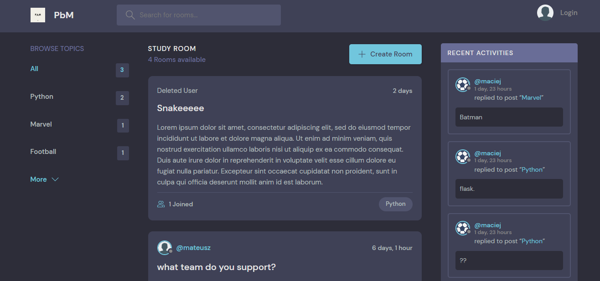

# Django - discord-like application




## Installation

1. The first thing to do is to clone the repository:
    ```
    git clone https://github.com/matt064/DJANGO---discord-like_application.git
    ```
2. Create a virtual environment to install dependencies in and activate it:
    ```
    python -m venv "path_to_catalog"'

    venv\Scripts\activate'
    ```

3. Then install the dependencies:
    ```
    (venv)pip install -r requirements.txt
    ```


## Start App

Run the App:


    (venv) python manage.py runserver

the development server will be started at :

    http://127.0.0.1:8000/